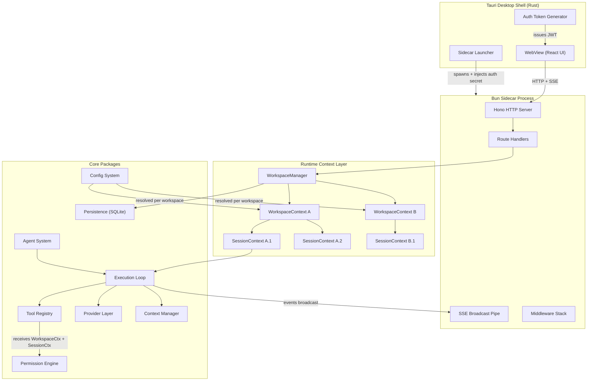
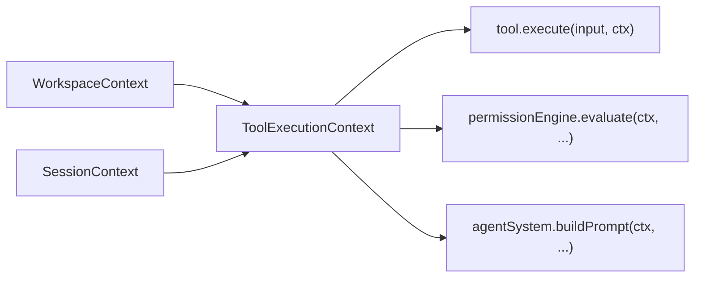
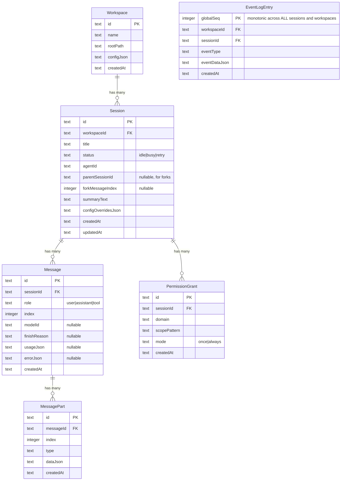

# Production-Grade Coding Assistant -- Architecture Plan

## 1. High-Level Architecture




---

## 2. Core Concept: Context Chain and Disposal

This is the architectural spine. Every operation in the system receives an isolated, disposable context chain: `WorkspaceContext -> SessionContext -> ToolExecutionContext`. Nothing is a floating global. Everything is scoped, everything is cleanable.

### WorkspaceContext -- One Per Open Directory

```typescript
class WorkspaceContext implements Disposable {
  readonly id: string;
  readonly rootPath: string;
  readonly config: ResolvedConfig;           // merged from all config layers
  readonly agentInstructions: string[];      // loaded AGENTS.md files
  readonly gitState: GitState;               // branch, dirty, worktree info
  readonly fileWatcher: FSWatcher;           // live filesystem monitoring
  readonly processManager: ProcessManager;   // tracks all spawned child processes
  readonly sessions: Map<string, SessionContext>;

  /** Cleanup everything when workspace closes */
  [Symbol.dispose]() {
    for (const session of this.sessions.values()) {
      session[Symbol.dispose]();
    }
    this.sessions.clear();
    this.fileWatcher.close();
    this.processManager.killAll();
  }
}
```

Created when a workspace is opened. Disposed when it is closed. Everything inside -- sessions, processes, watchers -- is cleaned up atomically.

### SessionContext -- One Per Active Session

```typescript
class SessionContext implements Disposable {
  readonly id: string;
  readonly workspace: WorkspaceContext;      // parent reference (never orphaned)
  readonly state: SessionStateMachine;       // idle | busy | retry
  readonly timeline: MessageTimeline;        // ordered messages + parts
  readonly permissionStore: PermissionStore; // approved scopes for this session
  readonly abortController: AbortController; // cancels the active execution
  readonly fileReadTimestamps: Map<string, number>; // freshness guard
  readonly writeLocks: Map<string, Lock>;    // per-file serialization

  [Symbol.dispose]() {
    this.abortController.abort('session disposed');
    this.writeLocks.clear();
    this.fileReadTimestamps.clear();
  }
}
```

### WorkspaceManager -- Top-Level Lifecycle Container

```typescript
class WorkspaceManager implements Disposable {
  private workspaces = new Map<string, WorkspaceContext>();

  async open(rootPath: string): Promise<WorkspaceContext> {
    const config = await configLoader.resolve(rootPath);
    const gitState = await detectGitState(rootPath);
    const instructions = await loadAgentInstructions(rootPath);
    const watcher = createFileWatcher(rootPath, config);
    const processManager = new ProcessManager();

    const ctx = new WorkspaceContext({
      id: generateWorkspaceId(),
      rootPath,
      config,
      gitState,
      agentInstructions: instructions,
      fileWatcher: watcher,
      processManager,
    });
    this.workspaces.set(ctx.id, ctx);
    return ctx;
  }

  async close(workspaceId: string): Promise<void> {
    const ctx = this.workspaces.get(workspaceId);
    if (ctx) {
      ctx[Symbol.dispose]();
      this.workspaces.delete(workspaceId);
    }
  }

  get(workspaceId: string): WorkspaceContext | undefined {
    return this.workspaces.get(workspaceId);
  }

  /** Shutdown: dispose all workspaces (process exit) */
  [Symbol.dispose]() {
    for (const ctx of this.workspaces.values()) ctx[Symbol.dispose]();
    this.workspaces.clear();
  }
}
```

### How Context Flows Into Registries and Tools

Registries (tool, agent, provider) are **stateless singletons** that hold definitions. They do not own workspace state. Context is injected at call time:




```typescript
// Derived at execution time -- not stored anywhere
interface ToolExecutionContext {
  workspace: WorkspaceContext;  // directory, git state, config, processes
  session: SessionContext;      // abort, permissions, locks, timestamps
  abort: AbortSignal;           // shorthand from session.abortController.signal
}
```

Tools never receive raw strings. They receive the live context object, giving them access to config, git state, process manager, write locks, and permission callbacks -- all properly scoped.

---

## 3. Monorepo Structure

Turborepo + Bun workspaces.

```
coding-assistant/
  turbo.json
  package.json
  bun.lock

  apps/
    desktop/                     # Tauri shell
      src-tauri/
        tauri.conf.json
        src/
          main.rs                # sidecar spawn, auth, IPC
          crypto.rs
      src/                       # React UI
        main.tsx
        App.tsx
        store/
          event-store.ts         # normalized EventStore (Map<wsId, Map<sessId, ...>>)
          store-provider.tsx     # React context providing the store
        hooks/
          useSessionMessages.ts  # reads from EventStore via useSyncExternalStore
          useWorkspace.ts
          usePermission.ts
        components/
          ChatPanel.tsx
          ToolCallCard.tsx
          PermissionDialog.tsx
          SessionSidebar.tsx
          WorkspaceSwitcher.tsx
        lib/
          api-client.ts          # typed HTTP client
          sse-pipe.ts            # dumb EventSource pipe -> pushes into EventStore

    server/                      # Bun sidecar binary
      src/
        index.ts                 # bootstrap, listen on dynamic port
        app.ts                   # Hono app factory
        routes/
          workspaces.ts          # open/close/list workspaces
          sessions.ts            # CRUD sessions within a workspace
          messages.ts            # POST new message -> triggers execution
          events.ts              # GET /api/events (dumb SSE broadcast)
          permissions.ts         # POST permission responses
          config.ts
          models.ts
        middleware/
          auth.ts
          cors.ts
          error-handler.ts
          request-id.ts
        scripts/
          compile.ts

  packages/
    shared/
      src/
        types/
          workspace.ts           # WorkspaceContext, WorkspaceInfo interfaces
          session.ts             # SessionContext, SessionStatus, Message, Part unions
          tool.ts                # ToolDefinition, ToolExecutionContext, ToolOutput
          provider.ts
          agent.ts
          permission.ts
          config.ts
          events.ts              # StreamEvent: always carries workspaceId + sessionId
        errors/
          base.ts
          tool-errors.ts
          provider-errors.ts
          permission-errors.ts
        ids.ts
        constants.ts

    core/
      src/
        workspace/
          context.ts             # WorkspaceContext class (Disposable)
          manager.ts             # WorkspaceManager: open, close, get, dispose
          git-state.ts           # detect branch, dirty, worktree
          file-watcher.ts        # workspace-scoped FS watcher
          process-manager.ts     # tracks spawned processes, killAll on dispose
        session/
          context.ts             # SessionContext class (Disposable)
          manager.ts             # SessionManager: create, list, archive, fork (per workspace)
          state-machine.ts       # idle -> busy -> retry -> idle
          timeline.ts            # ordered message + part append
        execution/
          loop.ts                # streaming execution loop (receives ctx chain)
          step-tracker.ts
          stop-conditions.ts
        events/
          bus.ts                 # global event bus (all events, all sessions)
          replay-log.ts          # persisted event log with global seq

    tools/
      src/
        registry.ts              # ToolRegistry: stateless singleton, definitions only
        types.ts                 # ToolDefinition contract
        context.ts               # buildToolExecutionContext(workspace, session)
        validator.ts
        lifecycle.ts
        definitions/
          file-read.ts
          file-write.ts
          file-edit.ts
          file-patch.ts
          grep.ts
          glob.ts
          bash.ts
          web-search.ts
          web-fetch.ts
          subagent.ts
          todo-read.ts
          todo-write.ts
          agent-instructions.ts
        index.ts

    providers/
      src/
        registry.ts
        catalog.ts
        resolver.ts
        adapters/
          openai.ts
          anthropic.ts
          google.ts
          deepseek.ts
          openai-compatible.ts
        index.ts

    agents/
      src/
        registry.ts
        profiles/
          build.ts
          plan.ts
          explore.ts
          summarize.ts
          title.ts
        loader.ts                # AGENTS.md loader (called during WorkspaceContext creation)
        merger.ts
        validator.ts

    permissions/
      src/
        engine.ts                # PolicyEngine: evaluate(ctx, toolName, input)
        types.ts
        store.ts                 # per-SessionContext approved scopes
        domains/
          file-edit.ts
          shell.ts
          external-dir.ts
          network.ts
          tool-loop.ts
        matchers/
          glob-matcher.ts
          command-parser.ts

    config/
      src/
        schema.ts
        loader.ts                # resolve(rootPath) -> ResolvedConfig
        merge.ts
        validator.ts
        migration.ts
        watcher.ts               # watches config files, invalidates WorkspaceContext.config
        defaults.ts

    context/
      src/
        budget.ts
        pruning.ts
        compaction.ts
        protections.ts

    persistence/
      src/
        database.ts
        migrations/
          001_initial.ts
        repositories/
          workspace-repo.ts
          session-repo.ts
          message-repo.ts
          event-log-repo.ts
          config-repo.ts
```

---

## 4. Core Data Model (SQLite)




Key change: `EventLogEntry` now carries `workspaceId` alongside `sessionId`. The `globalSeq` is a single monotonic counter across the entire server, not per-session.

---

## 5. Streaming Execution Loop (Core Engine)

The execution loop receives the full context chain. It does not resolve context itself -- the caller provides it.

File: `packages/core/src/execution/loop.ts`

```typescript
import { streamText, stepCountIs } from 'ai';

export async function* executeStream(
  workspace: WorkspaceContext,
  session: SessionContext,
  input: ExecutionInput,
): AsyncGenerator<StreamEvent> {
  const agent = agentRegistry.resolve(session.agentId);
  const model = providerLayer.resolveModel(
    agent.model ?? workspace.config.defaultModel
  );

  // Build AI SDK ToolSet: inject workspace+session context into every tool closure
  const rawTools = toolRegistry.toAISDKTools({ workspace, session }, {
    categories: agent.toolPolicy.allowed,
  });
  const tools = permissionEngine.wrapTools(rawTools, { workspace, session });

  // Build messages with context-aware pruning
  const messages = await contextManager.buildMessages(session, {
    model,
    budget: agent.maxOutputTokens,
  });

  // System prompt = agent base prompt + workspace AGENTS.md instructions
  const system = agentSystem.buildSystemPrompt(agent, workspace.agentInstructions);

  const result = streamText({
    model,
    system,
    messages,
    tools,
    abortSignal: session.abortController.signal,
    stopWhen: stepCountIs(agent.maxSteps ?? 25),
    prepareStep: ({ steps, stepNumber }) =>
      agentSystem.prepareStep(agent, { workspace, session }, steps, stepNumber),
  });

  for await (const part of result.fullStream) {
    session.abortController.signal.throwIfAborted();

    const event = mapPartToEvent(part, workspace.id, session.id);

    // Persist to event log (global seq assigned here)
    await persistence.appendEvent(event);

    // Push to global event bus (SSE pipe reads from this)
    globalEventBus.emit(event);

    // State transitions
    if (part.type === 'start') session.state.transition('busy');
    else if (part.type === 'finish') session.state.transition('idle');

    yield event;
  }
}
```

---

## 6. Tool Registration Contract (Extension Point)

### ToolDefinition -- What You Write to Add a Tool

```typescript
export interface ToolDefinition<TInput = unknown, TOutput = unknown> {
  name: string;
  description: string;
  inputSchema: z.ZodSchema<TInput>;
  category: ToolCategory;
  riskLevel: 'safe' | 'moderate' | 'dangerous';

  /** The tool receives the full context chain -- not raw strings */
  execute: (input: TInput, ctx: ToolExecutionContext) => Promise<ToolOutput<TOutput>>;

  onProgress?: (
    input: TInput, ctx: ToolExecutionContext,
    emit: (update: ToolProgressUpdate) => void,
  ) => void;
}
```

### ToolExecutionContext -- Derived From Workspace + Session

```typescript
export interface ToolExecutionContext {
  /** Full workspace context: rootPath, gitState, config, processManager */
  workspace: WorkspaceContext;
  /** Full session context: permissionStore, writeLocks, fileReadTimestamps */
  session: SessionContext;
  /** Shorthand for session.abortController.signal */
  abort: AbortSignal;
}
```

A tool like `bash` uses `ctx.workspace.processManager` to register the spawned process, so it gets killed on workspace close. A tool like `file-write` acquires `ctx.session.writeLocks.get(path)` to serialize concurrent writes. A tool like `file-read` checks `ctx.workspace.rootPath` for containment and updates `ctx.session.fileReadTimestamps`.

### ToolRegistry -- Stateless Singleton, Context Injected at Call Time

```typescript
export class ToolRegistry {
  private definitions = new Map<string, ToolDefinition>();

  register(def: ToolDefinition): void { ... }

  /** Build AI SDK ToolSet with context closures */
  toAISDKTools(
    ctx: { workspace: WorkspaceContext; session: SessionContext },
    filter: { categories?: ToolCategory[] },
  ): ToolSet {
    const result: ToolSet = {};
    for (const [name, def] of this.definitions) {
      if (filter.categories && !filter.categories.includes(def.category)) continue;
      const execCtx: ToolExecutionContext = {
        workspace: ctx.workspace,
        session: ctx.session,
        abort: ctx.session.abortController.signal,
      };
      result[name] = {
        inputSchema: def.inputSchema,
        execute: async (input) => {
          const output = await def.execute(input, execCtx);
          return output.result;
        },
      };
    }
    return result;
  }
}
```

Auto-discovery at startup:

```typescript
const toolModules = import.meta.glob('./definitions/*.ts', { eager: true });
for (const [, mod] of Object.entries(toolModules)) {
  registry.register((mod as any).definition);
}
```

---

## 7. Permission Engine

Receives the context chain. Evaluates against the workspace config's policy rules and the session's approved grants.

```typescript
export class PolicyEngine {
  wrapTools(
    tools: ToolSet,
    ctx: { workspace: WorkspaceContext; session: SessionContext },
  ): ToolSet {
    return Object.fromEntries(
      Object.entries(tools).map(([name, tool]) => [name, {
        ...tool,
        needsApproval: async ({ input }) => {
          const policy = ctx.workspace.config.permissions;
          const decision = this.evaluate(policy, name, input, ctx);
          if (decision.mode === 'allow') return false;
          if (decision.mode === 'deny') return 'denied';
          // 'ask' mode: check session grants first
          const grant = ctx.session.permissionStore.findMatch(name, input);
          if (grant) return false;
          return true;
        },
      }])
    );
  }
}
```

---

## 8. SSE Transport -- Dumb Broadcast Pipe

**Design decision:** The server broadcasts ALL events to the single SSE connection. No subscribe/unsubscribe. No server-side filtering. Every event carries `{ workspaceId, sessionId }` and the client stores it by key.

Why this works for a desktop app:

- Localhost connection. "Bandwidth" is memory copy, not network.
- Only 1-2 sessions stream concurrently. Idle sessions emit zero events.
- Each text-delta event is < 200 bytes. At 50 tokens/sec that is 10 KB/s total.
- Eliminating subscribe/unsubscribe removes an entire class of race conditions (SSE connects before subscription, reconnect forgets subscriptions, etc.).
- The server becomes trivially simple.

```mermaid
sequenceDiagram
  participant UI as React UI
  participant Store as EventStore
  participant SSE as GET /api/events
  participant Bus as Global EventBus
  participant Loop as Execution Loop

  UI->>SSE: Open EventSource (cookie auth, Last-Event-ID)

  Loop->>Bus: emit({workspaceId: A, sessionId: 1, type: text-delta, ...})
  Bus->>SSE: push event
  SSE->>UI: data: {workspaceId: A, sessionId: 1, type: text-delta, ...}
  UI->>Store: store.append(event)
  Store->>UI: notify subscribers for [A][1]

  Loop->>Bus: emit({workspaceId: B, sessionId: 3, type: tool-call, ...})
  Bus->>SSE: push event
  SSE->>UI: data: {workspaceId: B, sessionId: 3, type: tool-call, ...}
  UI->>Store: store.append(event)
  Note over Store: UI for session B.3 re-renders

  Note over UI: Crash/refresh
  UI->>SSE: Reconnect with Last-Event-ID: 147
  SSE->>Bus: replay from seq 148
  SSE->>UI: all missed events (all workspaces, all sessions)
  UI->>Store: store.append(each)
```


### Server Side

File: `apps/server/src/routes/events.ts`

```typescript
import { Hono } from 'hono';
import { streamSSE } from 'hono/streaming';

export const eventsRouter = new Hono()
  .get('/', async (c) => {
    return streamSSE(c, async (stream) => {
      const lastEventId = c.req.header('Last-Event-ID');

      stream.onAbort(() => {
        globalEventBus.removeListener(listener);
      });

      // Replay missed events on reconnect
      if (lastEventId) {
        const seq = parseInt(lastEventId, 10);
        const missed = await eventLog.getAfter(seq);
        for (const evt of missed) {
          await stream.writeSSE({
            data: JSON.stringify(evt),
            event: evt.eventType,
            id: String(evt.globalSeq),
          });
        }
      }

      // Broadcast all live events -- no filtering
      const listener = async (event: StreamEvent) => {
        await stream.writeSSE({
          data: JSON.stringify(event),
          event: event.type,
          id: String(event.globalSeq),
        });
      };

      globalEventBus.addListener(listener);

      // Keep connection alive until abort
      await new Promise(() => {});
    });
  });
```

Zero subscribe/unsubscribe endpoints. Zero SubscriptionManager. The server just pipes the global event bus into SSE.

### Global Event Bus (Server Core)

File: `packages/core/src/events/bus.ts`

```typescript
export class GlobalEventBus {
  private listeners = new Set<(event: StreamEvent) => void>();
  private seq = 0;

  emit(event: Omit<StreamEvent, 'globalSeq'>): void {
    const fullEvent = { ...event, globalSeq: ++this.seq };
    // Persist for replay
    eventLog.append(fullEvent);
    // Broadcast to all connected SSE clients
    for (const listener of this.listeners) {
      listener(fullEvent);
    }
  }

  addListener(fn: (event: StreamEvent) => void): void {
    this.listeners.add(fn);
  }

  removeListener(fn: (event: StreamEvent) => void): void {
    this.listeners.delete(fn);
  }
}
```

---

## 9. Frontend -- Normalized EventStore (No SSE Coupling)

The frontend has zero awareness of SSE mechanics. It has:

1. A **dumb pipe** that receives events and pushes them into a store.
2. A **normalized store** keyed by `[workspaceId][sessionId]`.
3. React hooks that read from the store via `useSyncExternalStore`.

### EventStore

File: `apps/desktop/src/store/event-store.ts`

```typescript
type SessionState = {
  status: SessionStatus;
  messages: UIMessage[];
  pendingPermissions: PermissionRequest[];
};

type WorkspaceState = {
  sessions: Map<string, SessionState>;
};

export class EventStore {
  private state = new Map<string, WorkspaceState>();
  private listeners = new Set<() => void>();

  /** Called by SSE pipe for every incoming event -- no filtering */
  append(event: StreamEvent): void {
    const ws = this.getOrCreateWorkspace(event.workspaceId);
    const sess = this.getOrCreateSession(ws, event.sessionId);

    // Reduce event into session state (pure function)
    applyEvent(sess, event);

    // Notify all React subscribers
    this.notify();
  }

  /** For useSyncExternalStore */
  subscribe(callback: () => void): () => void {
    this.listeners.add(callback);
    return () => this.listeners.delete(callback);
  }

  /** Snapshot for a specific session */
  getSession(workspaceId: string, sessionId: string): SessionState | undefined {
    return this.state.get(workspaceId)?.sessions.get(sessionId);
  }

  /** Snapshot for a workspace's session list */
  getWorkspaceSessions(workspaceId: string): Map<string, SessionState> | undefined {
    return this.state.get(workspaceId)?.sessions;
  }

  private notify() {
    for (const listener of this.listeners) listener();
  }
}
```

### SSE Pipe -- Dumb Delivery

File: `apps/desktop/src/lib/sse-pipe.ts`

```typescript
export class SSEPipe {
  private source: EventSource | null = null;
  private store: EventStore;

  constructor(store: EventStore) {
    this.store = store;
  }

  connect(baseUrl: string): void {
    this.source = new EventSource(`${baseUrl}/api/events`);
    this.source.onmessage = (e) => {
      const event: StreamEvent = JSON.parse(e.data);
      this.store.append(event);  // That is it. No routing, no filtering.
    };
    this.source.onerror = () => {
      // EventSource auto-reconnects with Last-Event-ID.
      // Missed events replayed by server. Store receives them. Done.
    };
  }

  disconnect(): void {
    this.source?.close();
    this.source = null;
  }
}
```

### React Hooks -- Read From Store

File: `apps/desktop/src/hooks/useSessionMessages.ts`

```typescript
export function useSessionMessages(workspaceId: string, sessionId: string) {
  const store = useEventStore(); // from context

  return useSyncExternalStore(
    store.subscribe,
    () => store.getSession(workspaceId, sessionId),
  );
}
```

No subscription management. No SSE awareness. The hook reads a snapshot from the store. The store is updated by the SSE pipe. React re-renders only the components whose snapshot changed.

---

## 10. Provider Layer with models.dev Catalog

File: `packages/providers/src/catalog.ts`

```typescript
export class ModelCatalog {
  private data: Record<string, ProviderEntry> = {};

  async refresh(): Promise<void> {
    const resp = await fetch('https://models.dev/api.json');
    this.data = await resp.json();
  }

  findModel(query: string): ModelInfo | null { ... }
  suggestSimilar(unknownId: string): string[] { ... }
}
```

Provider adapters use `@ai-sdk/*` packages:

```typescript
import { createOpenAI } from '@ai-sdk/openai';

export const openaiAdapter: ProviderAdapter = {
  id: 'openai',
  create: (config) => createOpenAI({ apiKey: config.apiKey, ...config.options }),
};
```

---

## 11. Agent System

Agent definitions are stateless profiles. Workspace-specific instructions (AGENTS.md) are already loaded in `WorkspaceContext.agentInstructions` during workspace open -- no re-reading at execution time.

```typescript
export const buildAgent: AgentProfile = {
  id: 'build',
  name: 'Build Agent',
  description: 'Implementation-focused agent with full tool access',
  systemPrompt: `You are a coding assistant...`,
  toolPolicy: {
    allowed: ['file-read', 'file-write', 'shell', 'search', 'web', 'task'],
    denied: [],
  },
  permissionProfile: {
    'file-write': 'ask',
    'shell': 'ask',
    'external-dir': 'deny',
    'network': 'ask',
  },
  model: undefined,
  maxSteps: 25,
};
```

System prompt construction combines the agent's base prompt with workspace instructions:

```typescript
function buildSystemPrompt(agent: AgentProfile, workspaceInstructions: string[]): string {
  return [
    agent.systemPrompt,
    ...workspaceInstructions.map(i => `<agent_instructions>\n${i}\n</agent_instructions>`),
  ].join('\n\n');
}
```

---

## 12. Configuration Merge Model

Precedence (later overrides earlier):

1. Built-in defaults
2. Global config (`~/.coding-assistant/config.json`)
3. Workspace config (`<workspace>/.coding-assistant/config.json`)
4. Local override (`<workspace>/.coding-assistant/config.local.json`)
5. Environment variables (`ASSISTANT_*`)
6. Inline overrides (per-session API params)

The resolved config is computed once during `WorkspaceManager.open()` and cached in `WorkspaceContext.config`. The config file watcher invalidates it on change.

---

## 13. Context Management

```typescript
export function shouldCompact(session: SessionContext, model: ModelInfo): boolean {
  const currentTokens = estimateTokenCount(session.timeline.messages);
  const contextLimit = model.limits.context;
  return currentTokens > contextLimit * 0.85;
}
```

Compaction uses the `summarize` subagent to compress older history while protecting recent steps, active todos, and latest diffs.

---

## 14. Tauri Desktop Shell

Minimal Rust. Only handles sidecar spawn, auth secret, dynamic port:

```rust
fn setup(app: &mut App) -> Result<(), Box<dyn Error>> {
    let port = find_available_port();
    let secret = generate_secret();
    let state = AppState { port, secret, server: None };
    app.manage(state);
    spawn_sidecar(app.handle(), port, &secret)?;
    Ok(())
}
```

---

## 15. Extensibility Summary

- **New tool**: Add one file to `packages/tools/src/definitions/`. Zero core changes.
- **New provider**: Add one file to `packages/providers/src/adapters/`. Zero core changes.
- **New agent profile**: Add one file to `packages/agents/src/profiles/`. Zero core changes.
- **New permission domain**: Add one file to `packages/permissions/src/domains/`. Zero core changes.
- **New config section**: Extend Zod schema in `packages/config/src/schema.ts`.
- **New SSE event type**: Extend union in `packages/shared/src/types/events.ts`.

All registries use `import.meta.glob` auto-discovery. No manual wiring.

---

## 16. Implementation Phases

**Phase 1 -- Foundation (Weeks 1-3):** Monorepo scaffold, shared types (WorkspaceContext/SessionContext interfaces, StreamEvent with workspaceId+sessionId), SQLite persistence, Hono server skeleton, Tauri sidecar launch, React shell with @openai/apps-sdk-ui theming, EventStore + SSE dumb pipe.

**Phase 2 -- Context Chain (Weeks 4-6):** WorkspaceManager open/close lifecycle, WorkspaceContext with config resolution + git state + file watcher + ProcessManager, SessionContext with state machine + abort + locks + timestamps, execution loop wrapping streamText with full context injection, tool registry with context closures, 3 initial tools (file-read, file-write, bash).

**Phase 3 -- Tools and Permissions (Weeks 7-9):** Full tool suite, permission engine with needsApproval wrapper and session grant store, domain handlers (file-edit, shell, external-dir, network, tool-loop), repetition detector.

**Phase 4 -- Providers and Agents (Weeks 10-11):** Provider catalog from models.dev, multi-provider support, fuzzy model resolver, agent profiles (build, plan, explore, summarize), AGENTS.md loading in WorkspaceContext, prepareStep integration.

**Phase 5 -- Polish (Weeks 12-14):** Config merge system with live reload, context compaction/pruning, event replay on reconnect, fork/branch sessions, cost telemetry, disposal testing for all edge cases, Bun single-file executable compile for all platforms.