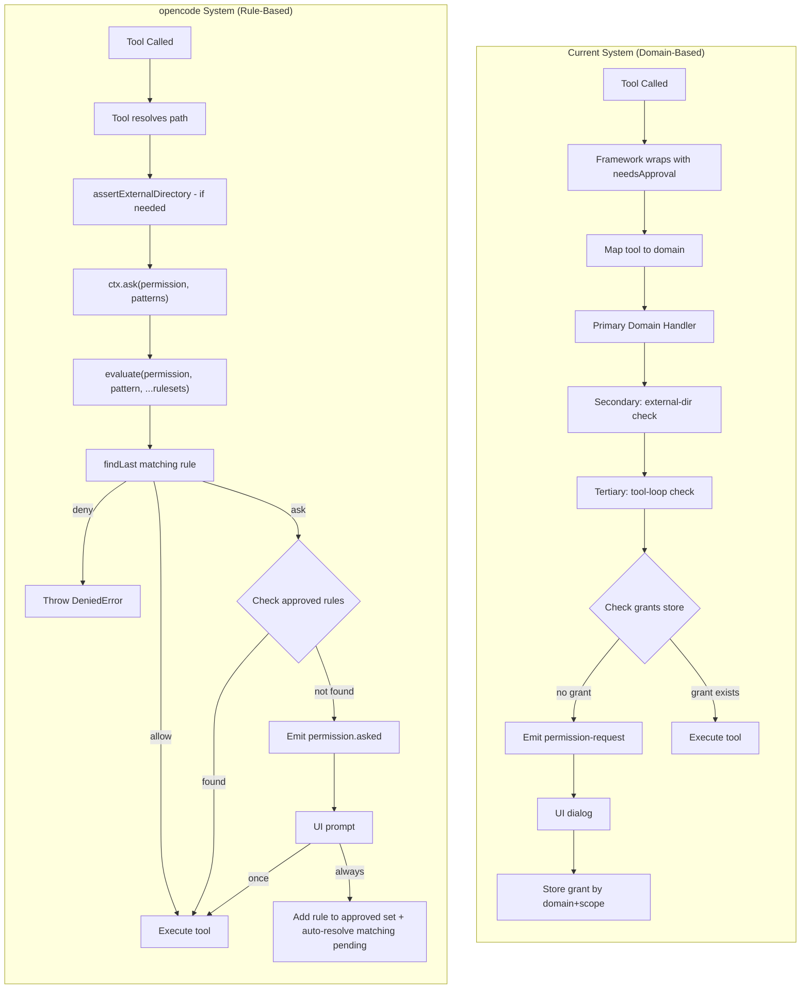

# Permission System Refactor: Adopt opencode's Rule-Based Model

## Problem Diagnosis

### Root Cause of the File Write Bug

The current system has a **double-evaluation flaw**. When `file-write` is called:

1. `PolicyEngine.evaluate()` maps `file-write` to the `file-edit` domain
2. `fileEditDomain.evaluate()` checks the RAW `input.path` (before resolution) against domain patterns
3. Then `externalDirDomain.evaluate()` runs as a **secondary check**, resolving the path against `workspaceRootPath`

The problem: the permission engine sees `input.path` as the LLM sent it (could be relative, absolute, or any form). The path resolution in `externalDirDomain` (`resolve(ctx.workspaceRootPath, filePath)`) may interpret it differently than the tool itself (`isAbsolute(input.path) ? input.path : join(ctx.workspaceRootPath, input.path)`). If the LLM sends an absolute path that IS inside the workspace but the relative check `rel.startsWith('..')` triggers falsely due to symlinks or normalization differences, the permission engine returns `deny` even though the file is in the CWD.

Additionally, the cascade order matters: even if `file-edit` domain says `allow`, the `external-dir` secondary check can override it with `deny`. This makes the behavior unpredictable.

### Architectural Debt

The current system has **~15 files** for permissions:

```
permissions/
  engine.ts          -- PolicyEngine class with wrapTools, evaluate, filterDeniedTools
  store.ts           -- PermissionGrantStore (domain-scoped grants)
  types.ts           -- DomainHandler, PermissionContext
  resolve-policy.ts  -- Merges agent profile with workspace policy
  descriptions.ts    -- Description/risk level helpers
  domains/
    file-edit.ts     -- File edit domain handler
    external-dir.ts  -- External directory domain handler  
    shell.ts         -- Shell command domain handler
    network.ts       -- Network access domain handler
    tool-loop.ts     -- Tool loop detection domain handler
  matchers/
    glob-matcher.ts  -- Glob pattern matching
    boundary-checker.ts -- Path boundary checking
    bash-ast.ts      -- Bash command AST parsing
    command-arity.ts -- Command arity matching
    command-parser.ts -- Command parsing
```

Each domain has its own evaluation logic. The `shell` domain parses bash ASTs, extracts paths, checks boundaries. The `file-edit` domain does glob matching. The `external-dir` domain resolves paths. They all interact in unpredictable ways through the cascade in `PolicyEngine.evaluate()`.

## How opencode Solves This

### Architecture Comparison




### Key Design Differences

**1. Permission evaluation is a single `findLast()` call**

opencode's `evaluate()` function (`[permission/next.ts:236](packages/opencode/src/permission/next.ts)`):

```typescript
export function evaluate(permission: string, pattern: string, ...rulesets: Ruleset[]): Rule {
  const merged = merge(...rulesets)  // just rulesets.flat()
  const match = merged.findLast(
    (rule) => Wildcard.match(permission, rule.permission) && Wildcard.match(pattern, rule.pattern)
  )
  return match ?? { action: "ask", permission, pattern: "*" }
}
```

No cascading domain checks. No secondary evaluations. Just: merge all rules, find the last one that matches both permission name AND pattern. Last match wins. Default: `ask`.

**2. Tool-initiated permissions (not framework-wrapped)**

In opencode, the TOOL decides when to ask for permission. The tool has already resolved the path, validated the input, etc. Example from `write.ts`:

```typescript
async execute(params, ctx) {
  const filepath = path.isAbsolute(params.filePath)
    ? params.filePath
    : path.join(Instance.directory, params.filePath)
  
  // 1. Check if outside workspace FIRST
  await assertExternalDirectory(ctx, filepath)
  
  // 2. Ask edit permission with the RESOLVED relative path
  await ctx.ask({
    permission: "edit",
    patterns: [path.relative(Instance.worktree, filepath)],
    always: ["*"],
    metadata: { filepath, diff }
  })
  
  // 3. Only then execute
  await Bun.write(filepath, params.content)
}
```

**3. Sensible defaults from `[agent.ts:55](packages/opencode/src/agent/agent.ts)**`:

```typescript
const defaults = PermissionNext.fromConfig({
  "*": "allow",            // Everything allowed by default
  doom_loop: "ask",        // Repeated tool calls → ask
  external_directory: {
    "*": "ask",            // Outside workspace → ask
  },
  question: "deny",
  read: {
    "*": "allow",
    "*.env": "ask",        // .env files → ask
    "*.env.example": "allow",
  },
})
```

File writes inside workspace are covered by `"*": "allow"` -- no special domain needed.

**4. "Always" approval auto-resolves matching pending requests**

When user clicks "Always Allow", the patterns are added to the approved ruleset. Then ALL matching pending requests are auto-resolved immediately (not just the current one). This is much better UX than our domain-scoped grant store.

## Refactoring Plan

### Phase 1: New Permission Core (replace `permissions/` directory)

**Create `[packages/core/src/permissions/permission.ts](packages/core/src/permissions/permission.ts)**` -- single file replacing the entire domain-based system. Modeled after opencode's `[permission/next.ts](/Users/dostonjon_yuldoshev/Documents/fork/opencode/packages/opencode/src/permission/next.ts)`:

```typescript
export namespace Permission {
  export type Action = 'allow' | 'deny' | 'ask';
  export type Rule = { permission: string; pattern: string; action: Action };
  export type Ruleset = Rule[];

  // Convert config object to flat ruleset:
  //   { "*": "allow", edit: { "*.env": "deny" } }
  //   => [{ permission: "*", pattern: "*", action: "allow" },
  //       { permission: "edit", pattern: "*.env", action: "deny" }]
  export function fromConfig(config: Record<string, Action | Record<string, Action>>): Ruleset;

  // Merge = flat concat. Last matching rule wins.
  export function merge(...rulesets: Ruleset[]): Ruleset;

  // Core evaluation: find the LAST rule that matches both permission AND pattern.
  // Default if no match: { action: "ask", permission, pattern: "*" }
  export function evaluate(permission: string, pattern: string, ...rulesets: Ruleset[]): Rule;

  // Returns set of tool names where `* : deny` matches their permission.
  // Used to remove tools from LLM context to avoid wasting tokens.
  export function disabled(tools: string[], ruleset: Ruleset): Set<string>;

  // Tool-initiated permission request.
  // Evaluates ruleset -> if allow: return -> if deny: throw DeniedError -> if ask: check approved, else emit event + block
  export async function ask(input: {
    permission: string;
    patterns: string[];
    always: string[];
    metadata: Record<string, any>;
    sessionId: string;
    ruleset: Ruleset;
  }): Promise<void>;
}
```

The `ask()` function manages pending requests + approved rules internally (session-scoped state), mirroring opencode's `PermissionNext.ask()`. When "always" reply comes in, the patterns from `always` are added to approved ruleset, then ALL matching pending requests for the same session are auto-resolved (opencode's cascade approval pattern from `[next.ts:200-225](/Users/dostonjon_yuldoshev/Documents/fork/opencode/packages/opencode/src/permission/next.ts)`).

**Create `[packages/core/src/permissions/wildcard.ts](packages/core/src/permissions/wildcard.ts)**` -- wildcard matching from opencode's `[util/wildcard.ts](/Users/dostonjon_yuldoshev/Documents/fork/opencode/packages/opencode/src/util/wildcard.ts)`:

```typescript
export namespace Wildcard {
  // `*` matches zero or more chars, `?` matches one char.
  // "ls *" matches both "ls" and "ls -la" (trailing space+wildcard is optional).
  export function match(str: string, pattern: string): boolean;
}
```

**Create `[packages/core/src/permissions/defaults.ts](packages/core/src/permissions/defaults.ts)**` -- default permission rules (mirrors opencode's `[agent.ts:55-73](/Users/dostonjon_yuldoshev/Documents/fork/opencode/packages/opencode/src/agent/agent.ts)`):

```typescript
import { Permission } from './permission.js';

export const defaultPermissionRules = Permission.fromConfig({
  '*': 'allow',              // Everything inside workspace = allowed by default
  doom_loop: 'ask',          // Repetitive identical tool calls = ask
  external_directory: {
    '*': 'ask',              // Paths outside workspace = always ask
  },
  read: {
    '*': 'allow',
    '*.env': 'ask',          // .env files = sensitive
    '*.env.*': 'ask',
    '*.env.example': 'allow',
  },
});
```

**Keep `[packages/core/src/permissions/matchers/bash-ast.ts](packages/core/src/permissions/matchers/bash-ast.ts)**` -- still needed by the bash tool to extract command names for pattern-based permission checks. But it's no longer called by the engine, only by the bash tool definition itself.

**Keep `[packages/core/src/permissions/descriptions.ts](packages/core/src/permissions/descriptions.ts)**` -- `buildPermissionDescription()` and `getRiskLevel()` are still useful for generating the `permission-request` event metadata shown in the UI.

### Phase 2: Tool Context with `ctx.ask()`

**Modify `[packages/core/src/tools/types.ts](packages/core/src/tools/types.ts)**` -- add `ask()` to the existing `ToolExecCtx` interface:

Current interface has 16 fields. We add one more:

```typescript
export interface ToolExecCtx {
  // ...all existing 16 fields remain unchanged...
  workspaceId: string;
  workspaceRootPath: string;
  sessionId: string;
  abort: AbortSignal;
  config: Record<string, unknown>;
  fileReadTimestamps: Map<string, number>;
  writeLock: (path: string) => Promise<{ release(): void }>;
  processSpawn: (...) => unknown;
  workspaceRef?: unknown;
  agentId?: string;
  isSubagent?: boolean;
  sessionManager?: unknown;
  messageId?: string;
  toolCallId?: string;
  emitMetadata?: (...) => void;
  getShellEnv?: (...) => Record<string, string>;
  processRegister?: (...) => void;

  // NEW: tool-initiated permission request
  ask(input: {
    permission: string;
    patterns: string[];
    always: string[];
    metadata: Record<string, any>;
  }): Promise<void>;
}
```

**Modify `[packages/core/src/tools/context.ts](packages/core/src/tools/context.ts)**` -- the `buildToolExecCtx()` function needs a new parameter to receive the `ask` function:

```typescript
export function buildToolExecCtx(
  workspace: { ... },  // unchanged
  session: { ... },    // unchanged
  options?: {
    // ...existing options...
    ask?: (input: { permission: string; patterns: string[]; always: string[]; metadata: Record<string, any> }) => Promise<void>;
  },
): ToolExecCtx {
  return {
    // ...all existing fields...
    ask: options?.ask ?? (async () => {}),  // no-op default for backward compat
  };
}
```

**Modify `[packages/core/src/tools/registry.ts](packages/core/src/tools/registry.ts)**` -- the `toAISDKTools()` method is unchanged because tools call `ctx.ask()` themselves. The AI SDK v6 `needsApproval` wrapping is no longer needed.

### Phase 3: Wire `ask()` in Execution Layer

**Modify `[packages/core/src/execution/step-resolver.ts](packages/core/src/execution/step-resolver.ts)**` -- this is where the `ask` function gets injected:

Current code (lines 96-158) builds `toolCtx` then wraps tools with `policyEngine.wrapTools()`. The new code:

```typescript
// 1. Build the merged ruleset for this agent
const agentInfo = await getAgentInfo(session.agentId);  // or from deps
const mergedRuleset = Permission.merge(
  defaultPermissionRules,
  agentInfo.permission,
  userPermissionRules,   // from workspace config
);

// 2. Build tool context WITH ask() injected
const toolCtx = deps.buildToolExecCtx(
  { id: workspace.id, rootPath: workspace.rootPath, ... },
  session,
  {
    ...existingOptions,
    ask: async (req) => {
      await Permission.ask({
        ...req,
        sessionId: session.id,
        ruleset: mergedRuleset,
        // The ask function needs access to the event emitter and registerRequest
        // These are passed via closure, same as current needsApproval does
      });
    },
  },
);

// 3. Build raw tools (NO wrapping with needsApproval)
const rawTools = deps.toolRegistry.toAISDKTools(toolCtx, { categories: allowedCategories });

// 4. Filter out fully-denied tools (same concept, simpler implementation)
const denied = Permission.disabled(Object.keys(rawTools), mergedRuleset);
for (const name of denied) delete rawTools[name];

// 5. Tools are ready -- no wrapping needed
const tools = rawTools;
```

This removes lines 137-155 (the `policyEngine.wrapTools()` block) and replaces with 5 lines.

**Modify `[packages/core/src/execution/deps.ts](packages/core/src/execution/deps.ts)**` -- remove `policyEngine` and `resolvePermissionPolicy` from the lazy import list:

```typescript
// REMOVE these two imports:
// import('../permissions/index.js'),
// import('../permissions/resolve-policy.js'),

// REMOVE from _cached:
// policyEngine: perms.policyEngine,
// resolvePermissionPolicy: resolvePolicy.resolvePermissionPolicy,

// ADD instead:
import('../permissions/permission.js'),
import('../permissions/defaults.js'),
```

**Modify `[packages/core/src/execution/types.ts](packages/core/src/execution/types.ts)**` -- remove `policyEngine` and `resolvePermissionPolicy` from `ExecutionDeps` interface (lines in the current DI container). Replace with:

```typescript
export interface ExecutionDeps {
  // ...all existing deps MINUS policyEngine and resolvePermissionPolicy...
  
  // NEW: Permission module
  permission: typeof import('../permissions/permission.js').Permission;
  defaultPermissionRules: import('../permissions/permission.js').Permission.Ruleset;
}
```

### Phase 4: Update Tool Definitions (16 tools, 7 need changes)

**Tools that need `ctx.ask()` added (7 tools)**:

`**[file-write.ts](packages/core/src/tools/definitions/file-write.ts)**` -- After path resolution (line 39-48), BEFORE write lock:

```typescript
async execute(input, ctx) {
  const filePath = isAbsolute(input.path) ? input.path : join(ctx.workspaceRootPath, input.path);
  const resolved = resolve(filePath);
  const rel = relative(ctx.workspaceRootPath, resolved);

  // Replace the throw with assertExternalDirectory
  await assertExternalDirectory(ctx, resolved);

  // Ask edit permission with the RESOLVED relative path
  await ctx.ask({
    permission: 'edit',
    patterns: [rel],
    always: ['*'],
    metadata: { filepath: resolved, path: rel },
  });

  // ...rest of execute (writeLock, assertFileReadBeforeWrite, etc.)
}
```

Key change: the permission check now happens AFTER path resolution, so the pattern (`rel`) is accurate. No more mismatch between what the engine checks and what the tool writes to.

`**[file-edit.ts](packages/core/src/tools/definitions/file-edit.ts)**` and `**[file-patch.ts](packages/core/src/tools/definitions/file-patch.ts)**` -- identical pattern: resolve path, `assertExternalDirectory()`, `ctx.ask({ permission: 'edit', ... })`.

`**[file-read.ts](packages/core/src/tools/definitions/file-read.ts)**` -- same pattern but with `permission: 'read'`:

```typescript
await assertExternalDirectory(ctx, resolved);
await ctx.ask({
  permission: 'read',
  patterns: [rel],
  always: ['*'],
  metadata: { filepath: resolved },
});
```

The `.env` protection is handled by the DEFAULT RULES: `read: { "*.env": "ask" }`. No special code needed in the tool.

`**[bash.ts](packages/core/src/tools/definitions/bash.ts)**` -- most complex change. Uses `bash-ast.ts` to extract command pattern:

```typescript
async execute(input, ctx) {
  const cwd = input.working_directory
    ? isAbsolute(input.working_directory) ? input.working_directory : join(ctx.workspaceRootPath, input.working_directory)
    : ctx.workspaceRootPath;

  // Check if CWD is outside workspace
  await assertExternalDirectory(ctx, cwd, { kind: 'directory' });

  // Extract command pattern for permission check (e.g. "git status *")
  const commands = extractCommands(input.command);
  const patterns = commands.map(cmd => normalizeToPattern(cmd.raw));

  await ctx.ask({
    permission: 'bash',
    patterns: patterns.length > 0 ? patterns : [input.command],
    always: ['*'],
    metadata: { command: input.command, cwd },
  });

  // ...rest of execute
}
```

`**[web-fetch.ts](packages/core/src/tools/definitions/web-fetch.ts)**` and `**[web-search.ts](packages/core/src/tools/definitions/web-search.ts)**`:

```typescript
// web-fetch:
await ctx.ask({ permission: 'webfetch', patterns: [input.url], always: ['*'], metadata: { url: input.url } });

// web-search:
await ctx.ask({ permission: 'websearch', patterns: ['*'], always: ['*'], metadata: { query: input.query } });
```

**Tools that DON'T need changes (9 tools)**: `grep`, `glob` (search-only, no writes), `subagent` (has own recursion check), `task-read`, `task-write`, `todo-read`, `todo-write` (session-scoped), `plan-save` (needs external-dir check -- add `assertExternalDirectory()` for home dir writes), `agent-instructions` (read-only system data).

**Create `[packages/core/src/tools/assert-external-directory.ts](packages/core/src/tools/assert-external-directory.ts)**`:

```typescript
import { resolve, relative } from 'node:path';
import * as path from 'node:path';
import type { ToolExecCtx } from './types.js';

function containsPath(parent: string, child: string): boolean {
  return !relative(parent, resolve(child)).startsWith('..');
}

export async function assertExternalDirectory(
  ctx: ToolExecCtx,
  target: string,
  options?: { bypass?: boolean; kind?: 'file' | 'directory' },
): Promise<void> {
  if (!target || options?.bypass) return;
  if (containsPath(ctx.workspaceRootPath, target)) return;

  const parentDir = options?.kind === 'directory' ? target : path.dirname(target);
  const glob = path.join(parentDir, '*');

  await ctx.ask({
    permission: 'external_directory',
    patterns: [glob],
    always: [glob],
    metadata: { filepath: target, parentDir },
  });
}
```

### Phase 5: Doom Loop Detection

The current `tool-loop.ts` domain handler tracks per-session call history in a module-level `Map`. In the new system, this moves INTO the `Permission.ask()` function or into the step processor.

The simplest approach: keep doom loop detection in `step-processor.ts` as a pre-check before tool execution. When N identical tool calls are detected, inject `ctx.ask({ permission: 'doom_loop', patterns: [toolName], ... })`. The default rule `doom_loop: "ask"` triggers the UI dialog.

This is exactly how opencode handles it in `[processor.ts:155-175](/Users/dostonjon_yuldoshev/Documents/fork/opencode/packages/opencode/src/session/processor.ts)`:

```typescript
if (lastThree.every(p => p.tool === value.toolName && JSON.stringify(p.input) === JSON.stringify(value.input))) {
  await PermissionNext.ask({
    permission: "doom_loop",
    patterns: [value.toolName],
    sessionID: ...,
    metadata: { tool: value.toolName, input: value.input },
    always: [value.toolName],
    ruleset: agent.permission,
  });
}
```

### Phase 6: Update Agent Profiles

**Modify `[packages/shared/types/agent.ts](packages/shared/types/agent.ts)**` -- change `permissionProfile` field:

```typescript
export interface AgentProfile {
  // ...existing fields...
  // REMOVE: permissionProfile: Record<string, PermissionMode>;
  // ADD:
  permission: PermissionRuleset;  // flat ruleset, already merged with defaults
}
```

**Modify `[packages/core/src/agents/validator.ts](packages/core/src/agents/validator.ts)**` -- update validation schema:

```typescript
// REMOVE: permissionProfile: z.record(z.enum(['allow', 'ask', 'deny'])),
// ADD:
permission: z.array(z.object({
  permission: z.string(),
  pattern: z.string(),
  action: z.enum(['allow', 'deny', 'ask']),
})),
```

**Modify each agent profile**:

`[build.ts](packages/core/src/agents/profiles/build.ts)`:

```typescript
import { Permission } from '../../permissions/permission.js';
import { defaultPermissionRules } from '../../permissions/defaults.js';

export const buildAgent: AgentProfile = {
  // ...unchanged fields...
  permission: Permission.merge(defaultPermissionRules),
  // build agent uses all defaults -- everything inside workspace is allowed
};
```

`[explore.ts](packages/core/src/agents/profiles/explore.ts)`:

```typescript
permission: Permission.merge(
  defaultPermissionRules,
  Permission.fromConfig({
    '*': 'deny',      // deny everything
    grep: 'allow',
    glob: 'allow',
    read: 'allow',
    bash: 'allow',
    webfetch: 'allow',
    websearch: 'allow',
  }),
),
```

`[plan.ts](packages/core/src/agents/profiles/plan.ts)`:

```typescript
permission: Permission.merge(
  defaultPermissionRules,
  Permission.fromConfig({
    edit: { '*': 'deny' },    // no file writes
    bash: {
      'ls *': 'allow', 'cat *': 'allow', 'head *': 'allow',
      'tail *': 'allow', 'grep *': 'allow', 'rg *': 'allow',
      'find *': 'allow', 'git log *': 'allow', 'git diff *': 'allow',
      'git status *': 'allow', 'wc *': 'allow', 'sort *': 'allow',
    },
  }),
),
```

`[universal.ts](packages/core/src/agents/profiles/universal.ts)`:

```typescript
permission: Permission.merge(
  defaultPermissionRules,
  Permission.fromConfig({
    external_directory: { '*': 'deny' },
  }),
),
```

`[title.ts](packages/core/src/agents/profiles/title.ts)` and `[summarize.ts](packages/core/src/agents/profiles/summarize.ts)`:

```typescript
permission: Permission.merge(
  defaultPermissionRules,
  Permission.fromConfig({ '*': 'deny' }),  // no tools at all
),
```

### Phase 7: Update Config Schema and Shared Types

**Modify `[packages/shared/types/permission.ts](packages/shared/types/permission.ts)**` -- replace entire file:

```typescript
export type PermissionAction = 'allow' | 'deny' | 'ask';

export interface PermissionRule {
  permission: string;
  pattern: string;
  action: PermissionAction;
}

export type PermissionRuleset = PermissionRule[];

export type PermissionReply = 'once' | 'always' | 'reject';

export interface PermissionRequest {
  id: string;
  sessionId: string;
  permission: string;
  patterns: string[];
  always: string[];
  metadata: Record<string, unknown>;
  // Keep toolName for UI display (derived from permission name)
  toolName?: string;
  description?: string;
  riskLevel?: string;
}

// REMOVE: PermissionDomain, PermissionDecision, PermissionGrant,
//         PermissionResponse, PermissionPolicy, PermissionDomainPolicy
```

**Modify `[packages/shared/types/events.ts](packages/shared/types/events.ts)**` -- update `PermissionRequestEvent`:

```typescript
export interface PermissionRequestEvent extends StreamEventBase {
  type: 'permission-request';
  requestId: string;
  permission: string;     // NEW: "edit", "bash", "external_directory", etc.
  patterns: string[];     // NEW: what patterns are being requested
  always: string[];       // NEW: what patterns to store on "always" approval
  toolName: string;       // Keep for UI display
  description: string;
  riskLevel: string;
  metadata?: unknown;     // Renamed from `input` for clarity
  // REMOVE: domain: string;
}
```

**Modify `[packages/shared/types/config.ts](packages/shared/types/config.ts)**` -- replace `PermissionPolicy` with flat config:

```typescript
export interface ResolvedConfig {
  // ...unchanged fields...
  // CHANGE:
  permissions: Record<string, PermissionAction | Record<string, PermissionAction>>;
  // Was: permissions: PermissionPolicy;
}
```

**Modify `[packages/core/src/config/schema.ts](packages/core/src/config/schema.ts)**` -- replace domain-based schema:

```typescript
// REMOVE:
// const permissionDomainPolicySchema = z.object({ ... });
// const permissionPolicySchema = z.object({ default, domains });

// ADD:
const permissionActionSchema = z.enum(['allow', 'ask', 'deny']);
const permissionRuleSchema = z.union([
  permissionActionSchema,
  z.record(z.string(), permissionActionSchema),
]);
const permissionSchema = z.record(z.string(), permissionRuleSchema).default({});
```

**Modify `[packages/core/src/config/defaults.ts](packages/core/src/config/defaults.ts)**` -- simplify:

```typescript
export const defaultConfig: ResolvedConfig = {
  // ...unchanged fields...
  permissions: {},  // empty = use defaults from defaults.ts
};
```

**Modify `[packages/shared/errors/permission-errors.ts](packages/shared/errors/permission-errors.ts)**` -- align with new error types:

```typescript
// Replace domain-centric errors with opencode-style errors:
export class RejectedError extends Error {
  constructor() {
    super('The user rejected permission to use this specific tool call.');
  }
}

export class CorrectedError extends Error {
  constructor(message: string) {
    super(`The user rejected with feedback: ${message}`);
  }
}

export class DeniedError extends Error {
  constructor(public readonly ruleset: PermissionRule[]) {
    super(`Permission denied by config rule: ${JSON.stringify(ruleset)}`);
  }
}
```

### Phase 8: Update Session Context

**Modify `[packages/core/src/session/context.ts](packages/core/src/session/context.ts)**`:

- Remove `PermissionGrantStore` import and `this.permissionStore` field
- Remove `clearToolLoopHistory(this.id)` from `[Symbol.dispose]()`
- The session no longer needs a grant store -- approved rules are managed by `Permission.ask()` state (session-scoped, keyed by sessionId)

### Phase 9: Update Server Layer

**Modify `[packages/server/services/permission-requests.ts](packages/server/services/permission-requests.ts)**` -- mostly unchanged, but the response data changes:

- `PermissionResult` adds `reply: PermissionReply` field (replacing `granted: boolean`)
- When "always" reply, the server needs to tell the core to add patterns to approved set

**Modify `[packages/server/routes/permissions.ts](packages/server/routes/permissions.ts)**` -- update response schema:

```typescript
// Response now sends: { requestId, reply: 'once' | 'always' | 'reject', feedback? }
// Instead of: { requestId, granted, mode, feedback }
```

### Phase 10: Update Frontend

**Modify `[packages/desktop/src/components/PermissionDialog.tsx](packages/desktop/src/components/PermissionDialog.tsx)**`:

- Replace `domain` display with `permission` name
- Show `patterns` instead of raw tool input
- Button actions already match: "Allow Once" = `once`, "Always Allow" = `always`, "Deny" = `reject`
- Keep the feedback input on deny (maps to `CorrectedError`)

**Modify `[packages/desktop/src/store/reducers/session-reducers.ts](packages/desktop/src/store/reducers/session-reducers.ts)**`:

- `applyPermissionRequest()` -- update field mapping (remove `domain`, add `permission`, `patterns`, `always`)
- `applyPermissionResponse()` -- update to handle `reply` field instead of `granted`

**Modify `[packages/desktop/src/hooks/usePermission.ts](packages/desktop/src/hooks/usePermission.ts)**` -- update API call signature.

### Phase 11: Update Permission Module Barrel Export

**Rewrite `[packages/core/src/permissions/index.ts](packages/core/src/permissions/index.ts)**`:

```typescript
// NEW exports (replaces 19 lines of old exports):
export { Permission } from './permission.js';
export { Wildcard } from './wildcard.js';
export { defaultPermissionRules } from './defaults.js';
export { buildPermissionDescription, getRiskLevel } from './descriptions.js';
export { extractCommands, extractCommandNames, extractReferencedPaths } from './matchers/bash-ast.js';
export type { CommandNode } from './matchers/bash-ast.js';
```

### Files to Delete (14 files)

```
packages/core/src/permissions/engine.ts
packages/core/src/permissions/store.ts
packages/core/src/permissions/types.ts
packages/core/src/permissions/resolve-policy.ts
packages/core/src/permissions/domains/file-edit.ts
packages/core/src/permissions/domains/external-dir.ts
packages/core/src/permissions/domains/shell.ts
packages/core/src/permissions/domains/network.ts
packages/core/src/permissions/domains/tool-loop.ts
packages/core/src/permissions/matchers/glob-matcher.ts
packages/core/src/permissions/matchers/boundary-checker.ts
packages/core/src/permissions/matchers/command-parser.ts
packages/core/src/permissions/matchers/command-arity.ts
```

### Files to Create (3 files)

```
packages/core/src/permissions/permission.ts           -- new core engine (~200 lines, replaces ~600 lines across 10 files)
packages/core/src/permissions/wildcard.ts              -- wildcard matching (~30 lines)
packages/core/src/tools/assert-external-directory.ts   -- workspace boundary utility (~25 lines)
```

### Files to Modify (22 files)

```
packages/core/src/permissions/defaults.ts              -- NEW file with default rules
packages/core/src/permissions/index.ts                 -- rewrite barrel exports
packages/core/src/permissions/descriptions.ts          -- keep but remove domain references
packages/core/src/tools/types.ts                       -- add ask() to ToolExecCtx
packages/core/src/tools/context.ts                     -- inject ask() in buildToolExecCtx
packages/core/src/tools/definitions/file-write.ts      -- add ctx.ask() + assertExternalDirectory
packages/core/src/tools/definitions/file-edit.ts       -- add ctx.ask() + assertExternalDirectory
packages/core/src/tools/definitions/file-patch.ts      -- add ctx.ask() + assertExternalDirectory
packages/core/src/tools/definitions/file-read.ts       -- add ctx.ask() + assertExternalDirectory
packages/core/src/tools/definitions/bash.ts            -- add ctx.ask() + command pattern extraction
packages/core/src/tools/definitions/web-fetch.ts       -- add ctx.ask()
packages/core/src/tools/definitions/web-search.ts      -- add ctx.ask()
packages/core/src/execution/step-resolver.ts           -- remove wrapTools, inject ask via closure
packages/core/src/execution/deps.ts                    -- update lazy imports
packages/core/src/execution/types.ts                   -- update ExecutionDeps interface
packages/core/src/session/context.ts                   -- remove PermissionGrantStore
packages/core/src/agents/profiles/*.ts (6 files)       -- new permission Ruleset format
packages/core/src/agents/validator.ts                  -- update validation schema
packages/core/src/config/schema.ts                     -- new permission config schema
packages/core/src/config/defaults.ts                   -- simplify default permissions
packages/shared/types/permission.ts                    -- replace all types
packages/shared/types/events.ts                        -- update PermissionRequestEvent
packages/shared/types/config.ts                        -- update ResolvedConfig
packages/shared/types/agent.ts                         -- replace permissionProfile with permission
packages/shared/errors/permission-errors.ts            -- new error classes
packages/server/services/permission-requests.ts        -- update response types
packages/server/routes/permissions.ts                  -- update response schema
packages/desktop/src/components/PermissionDialog.tsx   -- update fields
packages/desktop/src/store/reducers/session-reducers.ts -- update event handling
packages/desktop/src/hooks/usePermission.ts            -- update API call
```

### Migration Strategy and Edge Cases

**Backward compatibility for existing configs**:

- `fromConfig()` can detect old domain-based format (`{ default: "allow", domains: { ... } }`) and convert to flat rules
- Add a one-time migration in config loading that maps `domains.file-edit.mode: "ask"` to `edit: "ask"`, `domains.shell.allowPatterns: ["git *"]` to `bash: { "git *": "allow" }`, etc.

**MCP tools**:

- Any external MCP tools that go through the tool registry get `ctx.ask()` automatically since it's on `ToolExecCtx`
- MCP tools that don't call `ctx.ask()` will have no permission checks (same as current behavior for unregistered domains)

**Subagent permissions**:

- Subagents already have their own agent profile. In the new system, `ctx.ask()` evaluates against the SUBAGENT's merged ruleset, not the parent's
- The `step-resolver.ts` builds the ruleset per-agent, so this works naturally

**Bash dangerous commands**:

- Current `DANGEROUS_COMMANDS` set (rm, sudo, etc.) in `shell.ts` moves to default rules: `bash: { "rm *": "ask", "sudo *": "ask", ... }`
- Or kept as a hardcoded check in the bash tool before `ctx.ask()` (simpler, same behavior)

**Session-scoped approvals**:

- Approved rules live in `Permission` module's internal state, keyed by `sessionId`
- When session disposes, clean up approved rules for that session
- `SessionContext[Symbol.dispose]()` calls `Permission.clearApproved(sessionId)`

**Tool-loop detection without domain handler**:

- Move to `step-processor.ts` pre-execution check
- Keep the same `Map<sessionId, ToolCallRecord[]>` pattern
- When threshold exceeded, call `Permission.ask({ permission: 'doom_loop', ... })` which evaluates against rules (default: `ask`)

**The "always" cascade approval**:

- When user clicks "Always Allow" for `edit:*`, store rule `{ permission: "edit", pattern: "*", action: "allow" }` in approved set
- Then scan ALL pending requests for the same session -- any that now evaluate to "allow" get auto-resolved
- This is the critical UX improvement over the current system where each file needs separate approval

